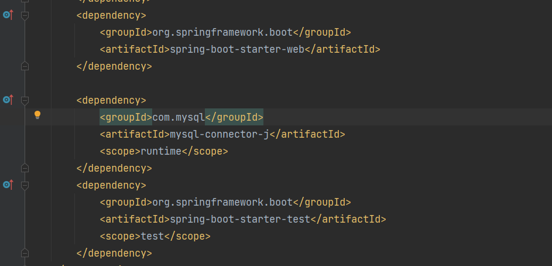
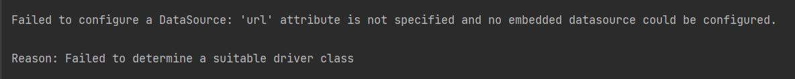

# Springboot Restful api with SQL
## Configurations
### Dependencies
- Update all dependencies in pom.xml
  - We need mysql, web, spring data jpa dependencies


### Installing Dependencies
- open project in command prompt or terminal
  ```cmd 
  mvn install
  ```

### Errors
- There will be a datasource error
  - 
  - Jdbc is how connection is established.
  - You could resolve it by adding database information in resources/application.properties file or adding a application.yaml file.
    ```yaml
    spring: 
    datasource:
    url: jdbc:mysql://localhost:3306/cloud_vendor?useSSL=false 
    username: 
    password:
    
    #JPA Settings
    jpa.hibernate.ddl_auto: create
    ```
    


